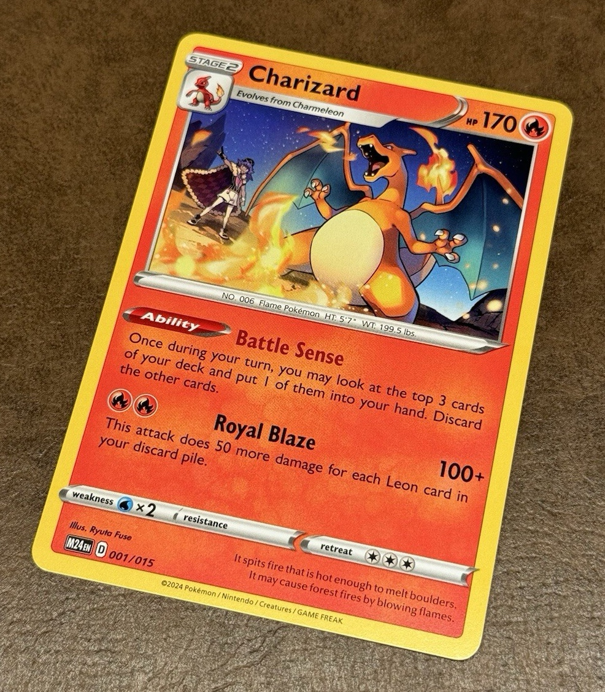
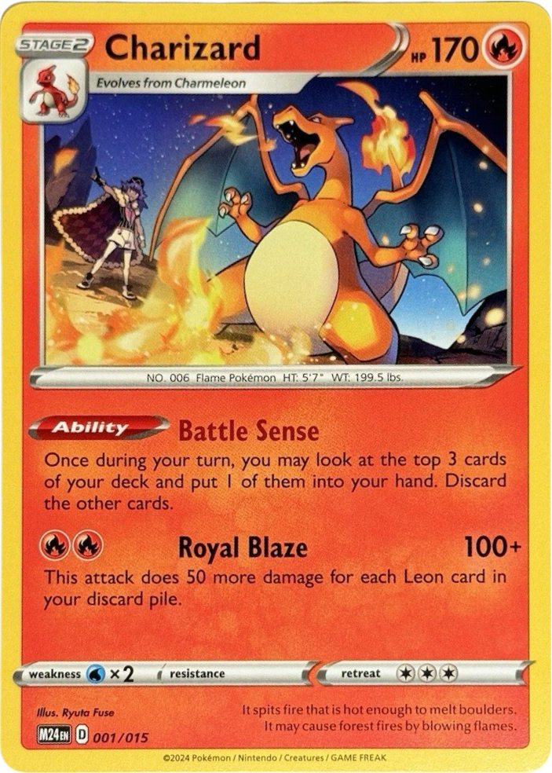
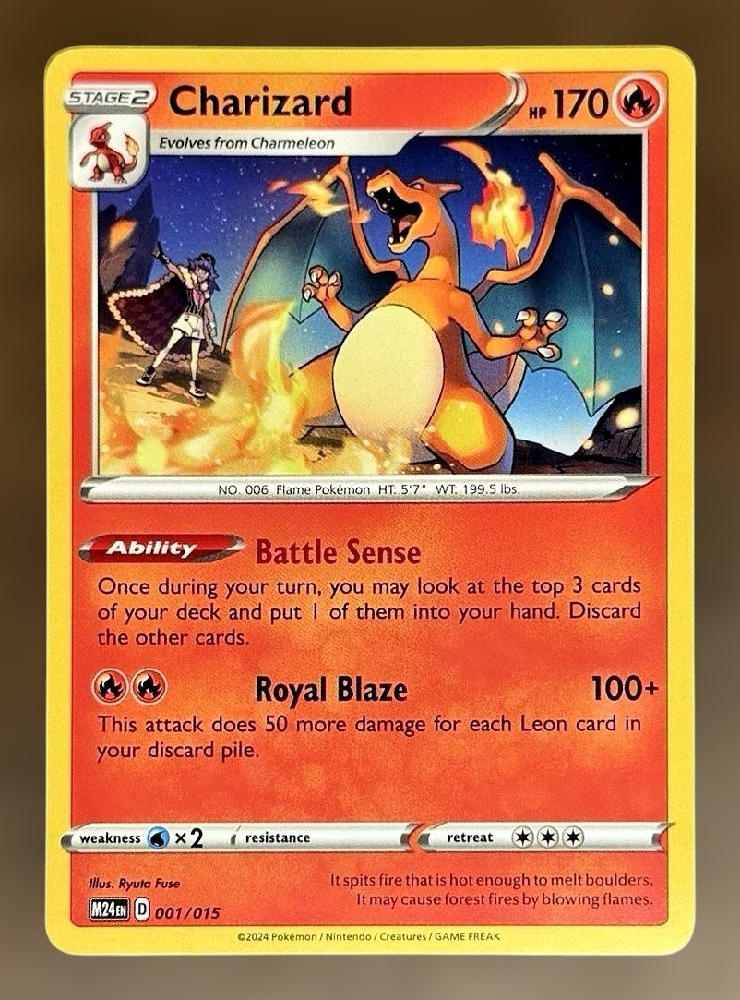
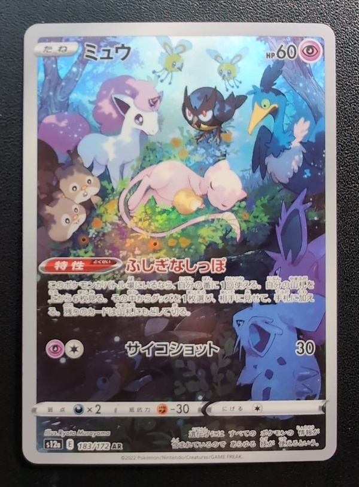
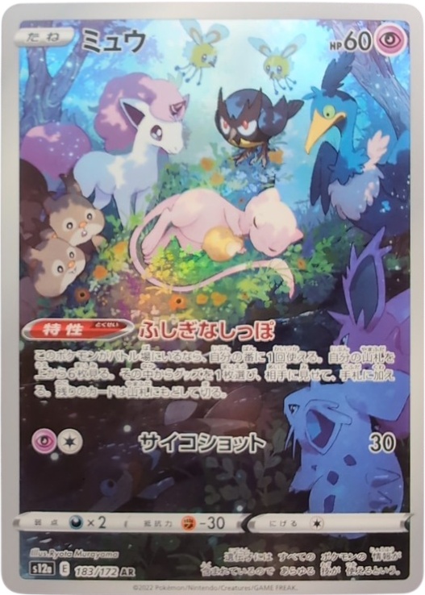
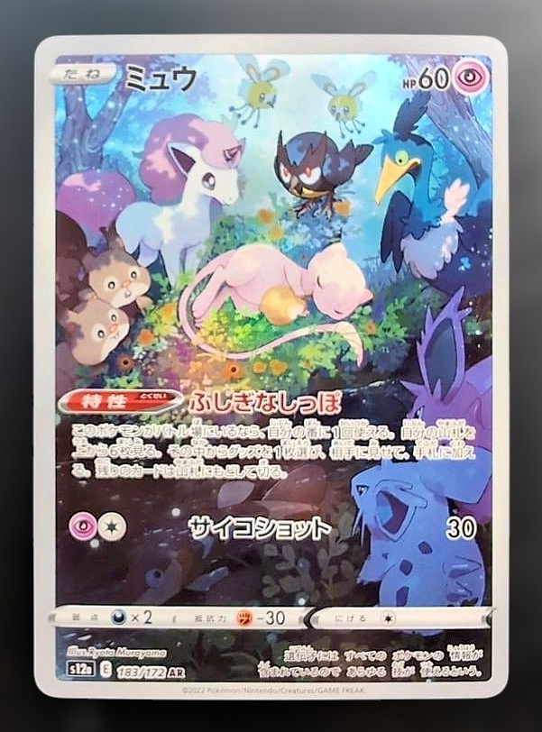
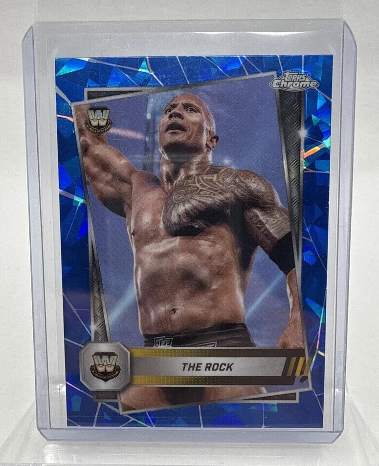
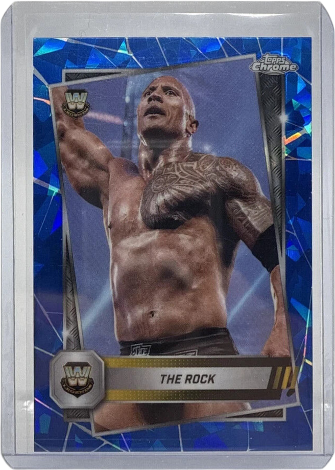
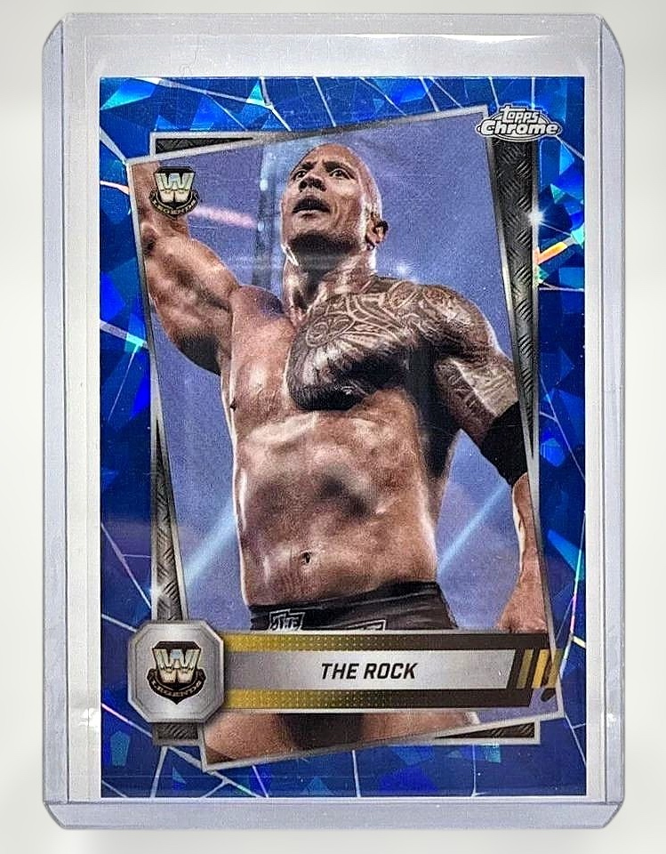

# Card Straight

A native iPhone app that photographs trading cards, uses a Photoroom foreground mask to remove the background and find the four edges, and produces a perspective-corrected transparent crop with automatic or user-selected proportions. Runs on iOS 17 or later.

## Before and after

Three bundled sample cards processed with the app’s current code: Photoroom mask, perspective correction, and optional background blur with relighting. **Original is on the left**, followed by **Edited · transparent** and **Edited · background blur**. Original and blurred images use the app’s mask-based crop with 5% padding; transparent images retain their alpha channel and tight framing.

These library samples have no camera calibration, so the examples use the **Standard card** proportion preset (2.5 : 3.5).

### Charizard

| Original · before | Edited · transparent | Edited · background blur |
| :---: | :---: | :---: |
|  |  |  |

### Mew

| Original · before | Edited · transparent | Edited · background blur |
| :---: | :---: | :---: |
|  |  |  |

### The Rock

| Original · before | Edited · transparent | Edited · background blur |
| :---: | :---: | :---: |
|  |  |  |

Regenerate these assets from the repository root with `PHOTOROOM_API_KEY` set in your environment:

```sh
swiftc -parse-as-library ios-perspective-correction/Processing/*.swift ios-perspective-correction/CardProcessor.swift Scripts/GenerateReadmeExamples.swift -o /tmp/generate-card-examples
/tmp/generate-card-examples
```

This runs the app’s processing code on macOS and makes nine Photoroom API calls: one segmentation and two finish requests per sample. The script does not store the API key.

## Run

1. Open `ios-perspective-correction.xcodeproj` in Xcode.
2. Select the `ios-perspective-correction` scheme and an iPhone destination.
3. For a physical iPhone, choose your development team in Signing & Capabilities and set a unique bundle identifier if needed.
4. Build and run. Open the gear icon and enter your Photoroom API key (the same key used in the web demo). It is stored in the device Keychain.
5. Tap **Take a photo** and allow camera access. Automatic capture defaults to enabled: keep one flat card fully visible. After a brief aiming period, the app requires two consecutive sharp frames; a steady hold is not required. Use **Auto: Off** or the shutter for manual capture. **Settings → Automatic shutter** and the camera’s Auto toggle share a saved preference that survives app restarts.
6. Review **Proportions**: calibrated captures default to Automatic. If a reliable estimate is unavailable, select Standard card or enter the actual width and height in the same units before saving. Rotate turns the corrected image clockwise without stretching it.

7. Under **Finish**, keep **Transparent** for PNG, or choose **Background blur** and tap **Apply background blur** for the demo’s Photoroom finish. Preview, save, or share the resulting JPEG. Applying the finish uses two image-edit API calls. Changing proportions or rotation requires applying the finish again; switching between existing transparent and blurred results makes no API calls.

**Choose from library** imports an existing image. **Try a sample card** includes the nine images from the original demo and works in Simulator, where a camera is unavailable. Sample scans also use Photoroom and require your API key. Tap the image preview to open full-screen comparison. Switch between Edited and Original, pinch to zoom, double-tap to zoom/reset, and tap Done to return. The Edited view uses the selected finish, including background blur. Compare Edited/Original, save both the original and corrected image to Photos, or share the corrected image. **Save before & after** saves a padded crop of the original at its native resolution and the selected finish (transparent PNG or blurred JPEG) in the same Photos change transaction. A denied camera or Photos permission leaves the other import/export options available.

The Original preview and saved Original are cropped to the largest mask component’s bounds, with the same 5% padding rule. Perspective and background remain unchanged in that crop. The full source is retained internally for calibration and blur generation. The transparent edited PNG remains a tight cutout. Preview, full-screen comparison, and Photos exports use the cropped framing.

## Reused demo logic

Source: `/Users/vincent/Developer/presales_automation/src/lib/trading-card-perspective/perspective.ts`, used by `/trading-card-perspective?defaultImages=true`.

`Processing/CardGeometry.swift` ports the original binary-mask detector to Swift:

- Flood-fill background connected to the image border, excluding enclosed holes from the outer boundary.
- Select the largest connected foreground component.
- Compute a convex hull and simplify it to four significant vertices.
- Assign boundary pixels to sides and perform two passes of robust least-squares line fitting, trimming rounded corners and outliers.
- Intersect the fitted lines, order the corners, and apply the original confidence and component-fill checks. The apparent aspect-ratio acceptance range is widened to 1:1–5:1 to allow square and nonstandard cards/slabs.
- Use the demo’s measured-area sizing. The 3.5 / 2.5 ratio is now an optional Standard card preset, not a mandatory output ratio.

The native adaptations are explicit:

- The app directly calls the same Photoroom `POST https://sdk.photoroom.com/v1/segment` endpoint as `api.ts`, with an `x-api-key` header and multipart `image_file` / `channels=alpha` fields. There is no Apple Vision segmentation or rectangle fallback in the correction pipeline. Vision rectangle detection gates automatic camera capture, and text recognition disambiguates card orientation; Photoroom’s mask still supplies the final correction geometry and background removal.
- The returned mask is read using the demo’s alpha-versus-luminance detection and thresholds. The full mask is also composited onto the original image as transparency before the perspective warp, removing background around rounded corners.
- Core Image performs the projective warp locally on both color and alpha. The default export is a transparent card-only PNG. The optional Background blur finish ports the demo’s full-canvas homography warp, retaining the surrounding photo and transparent warp borders. It applies the selected proportions and rotation before upload. Framing matches the demo: preserve the full input canvas, keep the card at the arithmetic mean of the four detected corners, preserve measured area, and shrink only to fit canvas width/height minus two pixels. No additional padding, margin, recentering, or output-size parameters are sent for this finish. After the API returns, the app crops to the mask-derived rectified item bounds with 5% of the longest item edge as padding on each side, clipped to the photo. The selected card ratio intentionally replaces the demo’s fixed ratio.
- Background blur reuses `api.ts`’s Mercari finish: two `POST https://image-api.photoroom.com/v2/edit` calls. First: `expand.mode=ai.auto`, `referenceBox=originalImage`, `removeBackground=false`. Then upload that expanded image with `background.blur.mode=gaussian`, `background.blur.radius=0.012`, `lighting.mode=ai.preserve-hue-and-saturation`, `removeBackground=false`, `referenceBox=originalImage`, and `export.format=jpeg`. The app previews and exports the returned JPEG.
- Photos are uploaded directly to Photoroom for segmentation. Local image processing runs in a dedicated actor. Keys are user-provided, saved in Keychain, and are never bundled or logged.
- EXIF orientation is normalized before upload and detection. Input is limited to 3,000 pixels on its longest edge, mask analysis to 1,600 pixels, and output to 2,400 pixels on its longest edge.
- Cancellation cancels the request and prevents stale results. Missing/invalid keys, exhausted credits, rate limits, network failures, and invalid masks produce recoverable errors.

API reference: [Photoroom Remove Background](https://docs.photoroom.com/api-reference-openapi).

## Automatic proportions and capture

Automatic capture checks preview frames at roughly 5 Hz. Once a whole card is visible, a 0.6-second aiming period begins. The app then requires two sufficiently detailed observations 0.15–0.5 seconds apart, without a continuous hold or pixel/corner movement veto. A brief missed detection or soft frame does not restart the aiming period; losing the card for over 0.8 seconds does. Framing accepts cards farther off-center, closer to the image edge, and at a wider range of angles.

Sharpness uses Laplacian variance on a fixed 256×256 interior luminance patch (threshold 80); very dark or soft current frames are rejected and restart the two-frame sharpness check. Earliest typical capture is about 0.8 seconds after finding the card. Autofocus gets up to 1.2 seconds to settle, after which measured sharpness takes precedence over a continuously active autofocus flag. Exposure duration is not a separate veto. The exact assessed frame is encoded with its calibration and orientation, and capture fires once. No preview frames are sent to Photoroom. Manual capture remains available. These heuristic thresholds still need physical-device validation across card finishes and lighting.

The AVFoundation camera captures a frame from the rear physical wide-angle camera, together with that exact sample buffer’s `kCMSampleBufferAttachmentKey_CameraIntrinsicMatrix`. It prefers 4K, falls back to 1080p where needed, disables electronic stabilization/cropping and zoom, and enables geometric distortion correction where supported. This is a still image taken from the calibrated video stream, rather than a separate full-resolution photo capture with potentially different intrinsics. Preview shows the full frame. Camera capture is presented in portrait.

`AVCaptureDevice.RotationCoordinator` supplies preview orientation. Both automatic and manual capture now use the rotation actually applied to that preview, rather than a separately changing gravity-based capture angle. Auto capture waits until that orientation has been set. Sensor pixels are left unrotated; the closest cardinal EXIF orientation accompanies the JPEG and the calibration. Image orientation and resizing are undone mathematically before projecting detected corners into calibrated camera coordinates. This avoids pairing a portrait/cropped image with a landscape/full-frame calibration matrix.

After correction, an on-device text-recognition check compares all four quarter turns at up to 1,200 pixels. It changes orientation only when sufficiently confident text strongly favors one turn. The same corner ordering and width/height swap are retained for local rerenders, calibration estimates, and the blurred finish. This also handles diagonal cards whose geometric top-left corner differs from the printed top. Ambiguous or text-free cards keep their geometric orientation; Rotate remains available. Photoroom still performs all background removal.

For a flat rectangle, the first two columns of its unit-square-to-camera homography represent the two physical side vectors up to a common scale. The ratio of their lengths gives width/height. Estimates are rejected for invalid calibration, inconsistent right angles, implausible ratios, or excessive sensitivity to small corner changes. This estimates proportions, not physical dimensions in millimeters.

There is no focal-length guess for library photos. When calibration is missing or rejected, the preview uses apparent proportions and export waits for an explicit Standard card or Custom choice. Custom accepts width and height in any matching units (ratios 1:5–5:1). Adjustments and rotation rerender locally from the retained cutout and never make another Photoroom request. Transparent exports preserve PNG transparency; the optional blurred finish exports JPEG.

References: [Apple camera intrinsics](https://developer.apple.com/documentation/avfoundation/avcaptureconnection/iscameraintrinsicmatrixdeliveryenabled), [rotation coordinator](https://developer.apple.com/documentation/avfoundation/avcapturedevice/rotationcoordinator), [rectangular structure geometry](https://lear.inrialpes.fr/people/triggs/events/iccv03/cdrom/hlk03/zhang.pdf).

## Project structure

- `ContentView.swift`: capture entry point, sample picker, processing and error states.
- `CameraCapture.swift`: AVFoundation capture, per-frame intrinsics, orientation, and preview lifecycle.
- `Processing/CameraCalibration.swift`: orientation/resize mapping and calibrated aspect-ratio estimation.
- `CardProcessor.swift`: orientation normalization, mask compositing, Core Image correction.
- `Processing/PhotoroomClient.swift`: direct multipart segmentation and two-stage blur requests, with API error handling.
- `APIKeySettings.swift`: secure key entry, replacement, and deletion through Keychain.
- `Processing/CardGeometry.swift`: reusable mask geometry, independent of UIKit and Vision.
- `CardResultView.swift`: original/corrected comparison, Photos saving, sharing.
- `Samples/`: original demo fixtures.

## Validation

Run the geometry regression suite with `swift test`. Blur framing includes golden destination coordinates evaluated directly from the supplied demo’s `correctPerspective` code, covering off-center portrait/landscape cards and both fit limits. It covers rounded corners, near-diagonal rotation, perspective, enclosed holes, disconnected noise, coordinate scaling, malformed masks, non-card rejection, the demo’s exact segmentation/finish multipart request fields, a mocked two-call finish verifying the expanded image is passed to the blur call, API error mapping, known camera projections, nonstandard/square proportions, pixel noise, and all eight EXIF orientations after resizing.

To test transparent PNG rendering, custom proportions, rotation, and the full-scene warp’s retained background and orientation with synthetic alpha and grayscale masks without an API call:

```sh
swiftc -parse-as-library ios-perspective-correction/Processing/*.swift ios-perspective-correction/CardProcessor.swift Scripts/VerifyMaskRendering.swift -o /tmp/verify-card-mask
/tmp/verify-card-mask
```

Debug Simulator launches with `--verify-camera-ui` open the camera controls without reading API keys (camera availability still depends on hardware). `--verify-proportions` use a synthetic calibrated card; add `--without-calibration` to verify the manual fallback. These fixtures make no API calls and do not read keys. Normal launches use the real camera/library/Photoroom flow.

Simulator builds validate the native UI. Live sample correction requires a valid Photoroom key; real camera capture requires a physical iPhone. Best results come from a single fully visible card on a contrasting background without strong glare. The detector chooses the largest foreground component, including a graded slab if that is the segmented subject. Inspect the comparison before saving.

To verify printed English and Japanese card orientation in all four rotations, including rerenders and the blur input, without API calls (macOS):

```sh
swiftc -parse-as-library ios-perspective-correction/Processing/*.swift ios-perspective-correction/CardProcessor.swift Scripts/VerifyCardOrientation.swift -o /tmp/verify-card-orientation
/tmp/verify-card-orientation
```
